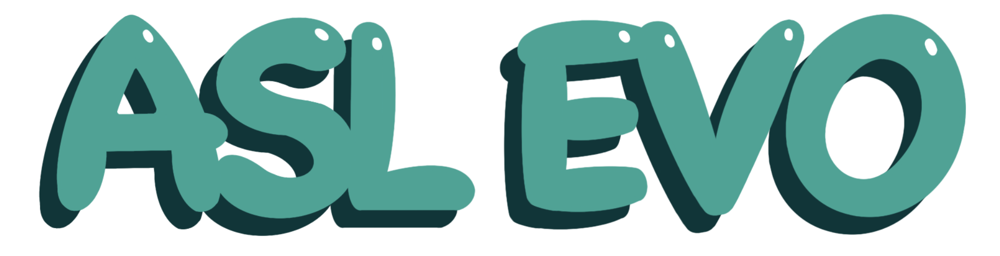
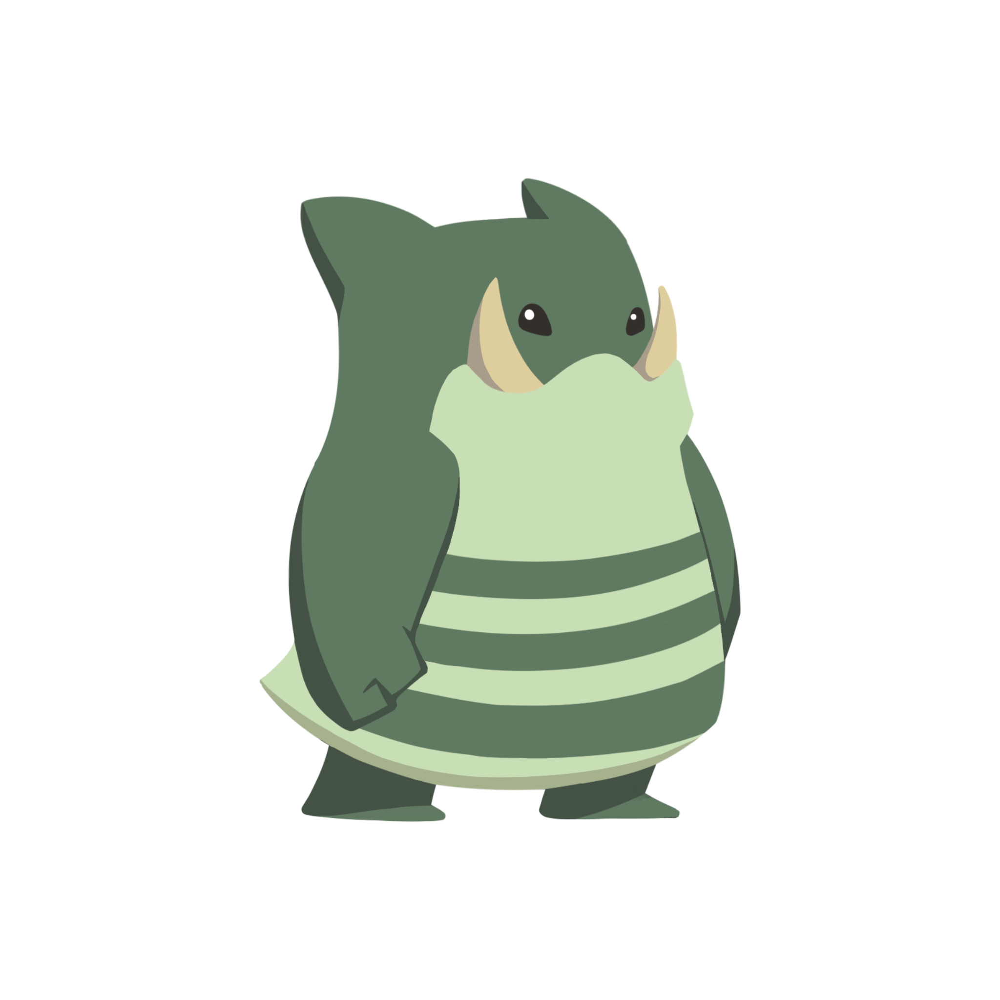

## Inspiration
Approximately 1.5 billion people across the world suffer from partial hearing loss, with 70 million suffering from full deafness. An estimated 700 million people will suffer from disabling hearing loss by 2050. Alongside these staggering hearling loss statistics, we were inspired by the idea of making sign language learning more fun and accessible for everyone. We wanted to create an app that could help people with hearing loss and deafness communicate better with others, and also raise awareness and appreciation of sign language among the general public. We also wanted to use gamification and personalization to motivate and engage users in the learning process.

## What it does
ASL EVO is a game that helps a person learn sign language while evolving their own little friend, Biff! Users have their own accounts, and start by learning the ASL alphabet and eventually progressing to basic phrases. For each question they answer correctly, they gain a point towards Biff's evolution. If a user answers enough questions correct in a row, they get a streak which doubles the points they get per question! Points and streaks are also tracked on a global leaderboard so users can engage in friendly competition with each other. Once a user gains enough points, Biff evolves into Buuf and finally Boof!

## How we built it
TypeScript and Next.js for the fullstack application (frontend pages and api routes)
MongoDB for storing a user's current points and streak.
Prisma as our ORM for interacting with MongoDB.
Tailwind for UI.

## Challenges we ran into
Getting the database interaction working was difficult, as our queries kept timing out on the MLive wifi. There were all kinds of issues with network access, database access, etc. Image resizing in css was also quite difficult.

## Accomplishments that we're proud of
Biff, Buuf, and Boof are all original characters that we created and drew during the hackathon! We also created the animations that play when each of them evolve!

## What we learned
We learned a lot about fullstack development, git, and Typescript.

## What's next for ASL EVO
We see many different paths for growth. The main place we can grow is in our ASL offerings by adding more topics, questions, and content and expanding our learning options. We also want to expand our character offerings to more characters beyond Biff and his evolutions, and allow players to be able to customize their characters to create a more personal and engaging game. Our next idea for a character is a fiery owl (name hasn't been decided yet).
